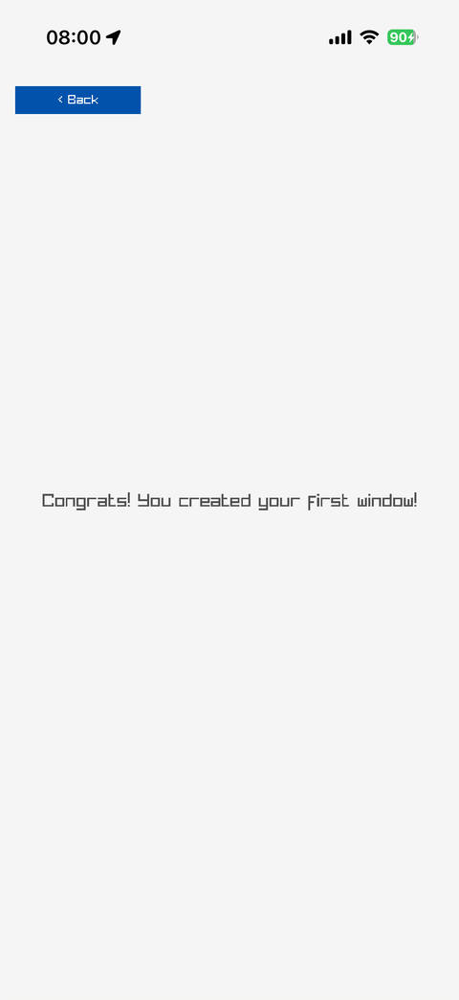
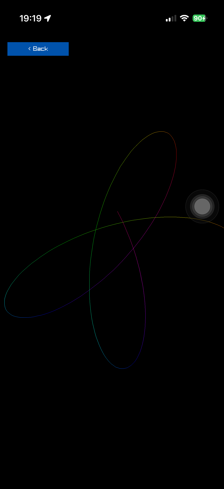
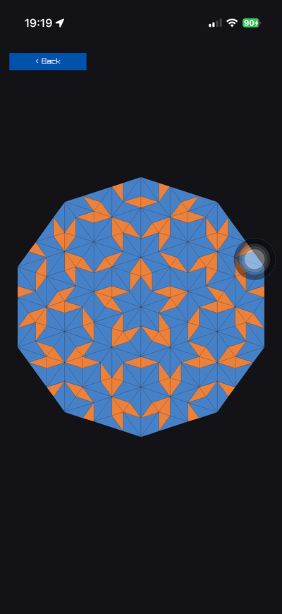
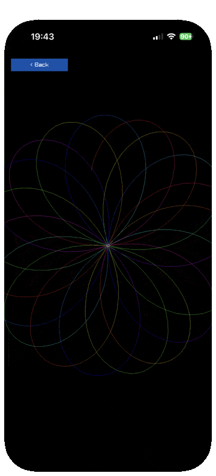
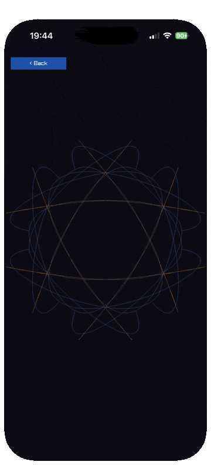
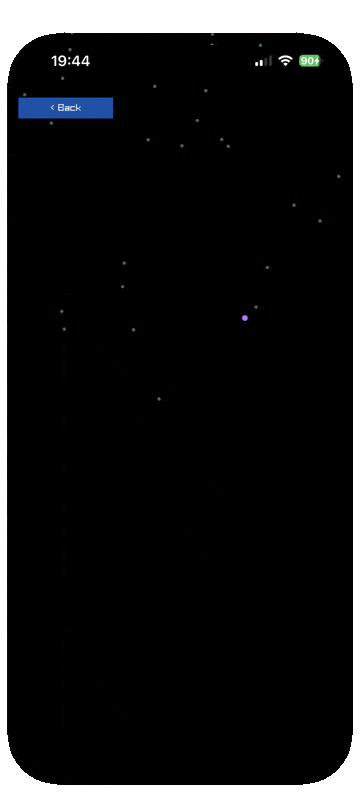
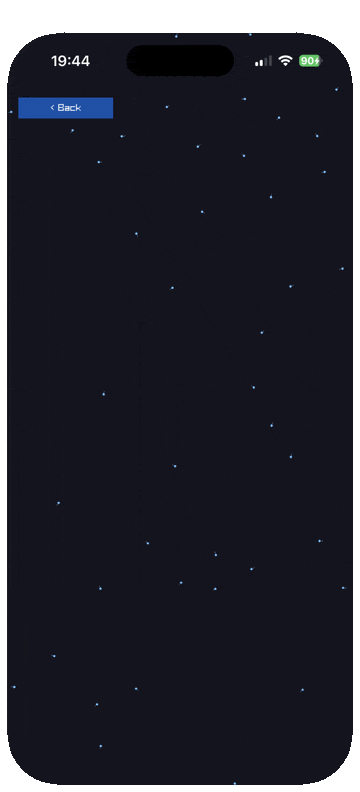

# raylib-ios

[](https://github.com/jlt-commons/raylib-ios/actions/workflows/ci.yml)
[](https://github.com/jlt-commons/raylib-ios/actions/workflows/site.yml)
[](https://jlt-commons.github.io/raylib-ios)
[](LICENSE)

raylib and SDL2 on an iPhone, driven from Clojure by
[jolt](https://github.com/jolt-lang/jolt), on threaded portable bytecode with
no JIT and nothing generated at run time.

This repo is the platform: the host loop, the gallery shell, the single-scene
runner, the raylib and SDL bindings, and the build, deploy and live tools. What
runs on it is [raylib-ios-demo](https://github.com/jlt-commons/raylib-ios-demo), a hundred and thirty-seven scenes,
each a pure `.cljc` simulation under an iOS owner loop of about thirty lines and
each its own sub-project that builds an app. Three of them, Following Eyes,
Touch Trail and Flappy Bird, are
[jasalt/jolt-android-experiment](https://github.com/jasalt/jolt-android-experiment)'s
files at `6d2b291`, identical apart from namespace names and whitespace. The other hundred
and thirty-four are ports from [raylib-jolt-demo](https://github.com/jlt-commons/raylib-jolt-demo)'s demos,
originally raylib-jlt's.

This repo keeps one scene of its own, Hello, the basic window. It is the proof that the
shell, the host loop and the tools work, and `-main` in `net.b12n.raylib-ios.gallery`
runs it as a one-card gallery:

<p>
  <a href="docs/images/hello.png"></a>
  <a href="docs/images/spirograph.png"></a>
  <a href="docs/images/penrose.png"></a>
</p>

*Photographs of an iPhone 17 Pro, captured unattended off the device. Click for
full size. The second and third are raylib-ios-demo scenes.*

<p>
  
  
  
  
</p>

*And moving, recorded off a live iPhone Mirroring window. The device bezel is
the mirror's, not a frame we drew. Nobody touched the phone for any of them.*

Licensed [EPL 2.0](LICENSE), matching the rest of jlt-commons. Third-party code
and attribution are in [`NOTICE`](NOTICE).

## Where the code came from

Larry Staton's [glimmer-ios-demo](https://github.com/statonjr/glimmer-ios-demo)
proved this recipe first, as two literate org notebooks: `examples/flappy`
(milestones 0 to 5, the toolchain and the loop) and `examples/gallery` (the
scene contract on top of it). Both are worth reading, because they keep the
mistakes as well as the answers.

This project is the same code as an ordinary source tree, so a build reads
files rather than tangling them out of prose first. `tools/extract-from-notebooks`
did the one-time extraction and is kept for provenance: it refuses to
extract without an explicit scratch destination, and it checks that the three
pure namespaces still here are their upstream files apart from namespace names and
whitespace. The three scenes from the same source are checked by raylib-ios-demo.

```
$ ./tools/extract-from-notebooks
identity of the pure namespaces (jasalt/jolt-android-experiment @ 6d2b291),
upstream names put back and layout normalised, against the table's :sha:
  src/net/b12n/raylib_ios/gallery/core.cljc            ok  887e96fd6a37c605
  src/net/b12n/raylib_ios/gallery/diagnostics.cljc     ok  df06972101085722
  src/net/b12n/raylib_ios/gallery/ui.cljc              ok  402ba8191b64a426
```

## raylib has no iOS backend, and does not need one

`src/platforms/` in raylib 6.0, the version this project pins, holds
`rcore_android.c`, `rcore_desktop_{glfw,rgfw,sdl,win32}.c`, `rcore_drm.c`,
`rcore_memory.c`, `rcore_web.c`, `rcore_web_emscripten.c` and
`rcore_template.c`. There is no `rcore_ios.c`, and the flappy notebook reports
that raylib issue #330, "Try to support iOS platform", was closed in 2018
without one. Writing that file from scratch means a UIWindow, a GLES layer,
touch handling and the loop: several hundred lines of Objective-C.

The shortcut is SDL. Build raylib with `PLATFORM=SDL` and
`GRAPHICS_API_OPENGL_ES2` against an SDL2 built for iOS, and SDL's own iOS
support becomes the platform layer. That collapses the whole problem to
"build SDL", which is well trodden.

Both libraries go into the executable as static archives. `jolt build
--target` emits the whole binary and Chez owns `main`, so no host process
exists to `dlopen` a shared library, and every `defcfn` resolves against the
process image at first call. This is why the project declares no dependencies
at all: there is no `:jolt/native` entry naming `libraylib.dylib` to satisfy,
because there is no library to load.

## Prerequisites

- **jolt 0.8.0 or newer.** `deps.edn` sets the floor with `:jolt/min-version`,
  and jolt refuses to build below it. `ffi/write` swapped its value and offset
  arguments at 0.8.0, and because both are integers an older jolt cannot tell
  the two spellings apart: it would write the wrong byte to the wrong place in
  silence. Every struct here goes through `ffi/layout` and `write-field`,
  which read the same on either side, so the floor is belt and braces.
- **Chez Scheme 10.4.1 on `PATH` as `chez`.** The pin is load bearing. A
  target pack's xpatch is compiled Scheme that loads only into the exact Chez
  that produced it.
- **Xcode**, for the iOS SDK and `devicectl`.
- **jolt v0.8.15 for device builds with the nREPL.** `jolt live` needs it for now;
  see the RUNBOOK.
- **cmake**, to cross-build the two archives.
- **A paired iPhone and an Apple Development identity.** Signing uses whatever
  team wildcard profile already covers your account; `tools/ios/deploy.sh`
  finds it, validates it and embeds it.

No private repositories are needed. `tools/ios/pack.sh` points at a checkout
of [jolt](https://github.com/jolt-lang/jolt), whose `make-pack.sh` reads only
from a ChezScheme checkout, so nothing from a jolt tree ends up in a pack.

## Quick start

```sh
jolt test                            # the pure namespaces, Hello, and the shell's smoke tests

SDK=device jolt deps                 # SDL 2.32.10 and raylib 6.0, static, iphoneos
NS=net.b12n.raylib-ios.link  TARGET=device jolt build-app     # does it link?
UDID=<hardware udid> jolt deploy                # sign, install, launch, watch stdout

NS=net.b12n.raylib-ios.gallery TARGET=device jolt build-app     # the platform gallery: Hello
UDID=<hardware udid> CONSOLE=0 jolt deploy      # detached, for actually playing
```

To run the scenes, check out [raylib-ios-demo](https://github.com/jlt-commons/raylib-ios-demo) beside this repo and run
`UDID=<hardware udid> bb gallery` there for all of them in one app, or
`bb asteroids` for one on its own. Its `common/deps.edn` points at this
checkout, and its `scripts/ios_tools.clj` calls the build, deploy and live scripts
here with `PROJECT_DIR` set to its own sub-project.

`jolt devices` lists what `deploy` can talk to, and prints the **hardware**
udid (`00008150-...`), which is what a provisioning profile lists under
`ProvisionedDevices`. Passing the CoreDevice identifier instead makes the
device-coverage check fail against a profile that covers the phone perfectly
well.

The first `jolt deps` takes a few minutes. After that both archives are
cached under `~/dev/{sdl2,raylib}-ios-dev`.

[Your own app](docs/guide/your-own-app.md) walks through starting a project of
your own, from the dependency to the first build.

The build tools work on the project they are run from, so another repo can use
them. `PROJECT_DIR` (default: the current directory) is the jolt project and
holds `RaylibIOS.app` afterwards; `NS` is the namespace to build. `live.sh`
takes `NS` too, for a live build of something other than the platform gallery.
`DRY_RUN=1` on `build.sh` prints what it resolved and stops:

```sh
cd ~/dev/my-app && NS=my.app.main TARGET=device sh /path/to/raylib-ios/tools/ios/build.sh
```

A project that shows a single scene full screen calls
`(net.b12n.raylib-ios.runner/run! (my-scene/scene))` from its `-main`, and one that
wants a menu calls `(net.b12n.raylib-ios.gallery/run! {:scenes [...] :categories [...]})`.
Either needs the scenes' `.draw` namespaces required by the app namespace, since
neither loads any. See the RUNBOOK.

For live development against the running app, and for every failure worth
recognising on sight, see [`tools/ios/RUNBOOK.md`](tools/ios/RUNBOOK.md):

```sh
jolt live                                # the platform gallery with an nREPL
jolt proxy                               # another terminal: forward it over USB
tools/ios/nrepl-eval 7888 '(System/getenv "HOME")'   # prove it is the phone
```

Reads are free. Anything touching raylib goes through
`net.b12n.raylib-ios.host/on-next-frame!`, which runs it on the main thread at the top of
the next frame, because an eval lands on the nREPL thread and the toolkit is
main-thread-affine.

That gives you jolt's built-in ops: `clone`, `describe`, `eval`, `load-file`,
`close`. Enough for a script or a prompt. For an editor, `CIDER=1 jolt live`
builds `net.b12n.raylib-ios.live-cider` under the `:cider` alias and adds completions,
`info`, `eldoc`, the namespace browser, macroexpansion, apropos and the test
ops, by composing [jolt-lang/nrepl](https://github.com/jolt-lang/nrepl) over
the same handler. It is the project's only dependency and it is opt-in, which
is why the paragraph above can still say there are none: 27 MB and no deps by
default, 33 MB and three with it.

### Namespaces worth building

| namespace | what it does |
|---|---|
| `net.b12n.raylib-ios.draw` | the public draw API: the `draw-scene!` multimethod every scene's draw namespace extends, and the helpers `color`, `clear-to!`, `stroke!`, `outline!`, `draw-caption!`, `draw-in-field!` and `host-measure`. See below. raylib-ios-demo's 136 draw namespaces require it |
| `net.b12n.raylib-ios.link` | one call into each archive, no window. Proves the link, the frameworks and the export trie |
| `net.b12n.raylib-ios.touch` | scalar touch polling, press edges, a marker under the finger |
| `net.b12n.raylib-ios.gallery` | the shell: `run!` takes `{:scenes :categories}` and draws the menu, hit testing and Back. `-main` runs Hello alone |
| `net.b12n.raylib-ios.runner` | `run!` shows one scene full screen, with no menu and no Back (needs the scene's `.draw` namespace required by the app) |
| `net.b12n.raylib-ios.runner.live` | `live-run!`: the same with an nREPL, for a one-scene app's dev build |
| `net.b12n.raylib-ios.live` | the gallery shell plus an nREPL (`live-run!` takes the same map), so an editor can drive the running app |
| `net.b12n.raylib-ios.live-cider` | the same with the cider-nrepl ops, under `-A:cider` (the one optional dependency) |

The shell requires no scene beyond Hello. An app that wants more lists them itself,
the way raylib-ios-demo's generated registry does, and requires each scene's draw
namespace.

Ported examples live in [raylib-ios-demo](https://github.com/jlt-commons/raylib-ios-demo). They are pure `.cljc` in the
same shape as the three from the Android experiment, so they test on the build
host, and each scene's `draw-scene!` method sits beside it. `spirograph` was the first,
from raylib-jolt-demo's demos (originally raylib-jlt's); porting one means
turning a namespace that owns its own loop into a reducer over frames, and
deriving geometry from the live screen instead of a fixed 800x450.

Two guides worth reading before adding to this:
[docs/guide/porting-an-example.md](docs/guide/porting-an-example.md) for the
four changes an example needs, and
[docs/guide/performance-on-a-phone.md](docs/guide/performance-on-a-phone.md)
for why the first two ports ran at 15 fps and what fixed them. The short
version of the second is that the FFI was never the problem.

**Develop with `DEV_BUILD=1`.** A release build inlines across call sites, so a
var redefined over the nREPL reaches the REPL and not the running loop. See the
RUNBOOK.

`net.b12n.raylib-ios.link` and `net.b12n.raylib-ios.touch` are bring-up tools, kept on purpose. Nothing
runs them and they are not dead code: they are the two rungs that isolate a
failure when the gallery does not come up. `link` calls one function from each
archive with no window at all, so it separates a broken link, a missing
framework or an empty export trie from anything to do with rendering. `touch`
is the smallest thing that draws and responds to a finger. Reach for them first
after an Xcode, SDK, SDL or raylib bump, when the useful question is which
layer moved rather than what the gallery is doing.

### The draw API

`net.b12n.raylib-ios.draw` is public, and renaming anything in it breaks every
project that draws scenes. A scene draws through a method of `draw-scene!`,
dispatched on its `:id`:

```clojure
(ns my.scene.draw
  (:require [net.b12n.raylib-ios.draw :as draw]))

(defmethod draw/draw-scene! :my-scene [id state {:keys [k m safe]}]
  (draw/clear-to! [20 24 40 255])
  ...)
```

A method receives:

- `id`, the scene's id.
- `state`, the scene's own state as its `:update` last returned it.
- an env map `{:k :m :safe}`. `k` is the display scale, pixels per UIKit
  point. `m` is the scene's metrics, and its `:screen` is the size of the safe
  region, not of the display. `safe` is the safe region, `{:x :y :width
  :height}` in pixels. The host has already translated the origin to its corner
  and scissored to it.

The helpers are `color` (an `[r g b a]` vector as a raylib color), `WHITE`,
`clear-to!`, `stroke!` (a line a few pixels wide), `outline!` (a one-pixel
rectangle outline), `draw-caption!`, `draw-in-field!` (scissor to a 3D field)
and `host-measure` (raylib's own text width).

## Layout

```
src/net/b12n/raylib_ios/objc.clj      three Objective-C runtime calls, and nothing else
src/net/b12n/raylib_ios/probe.clj     the measuring apparatus, all of it off by default
src/net/b12n/raylib_ios/host.clj      the owner loop: SDL_UIKitRunApp, InitWindow, the frame
src/net/b12n/raylib_ios/{link,touch}.clj   the bring-up scenes for that host
src/net/b12n/raylib_ios/gallery.clj   the shell: run! takes {:scenes :categories}, -main shows Hello
src/net/b12n/raylib_ios/scenes/       Hello, the platform's one scene (hello.cljc, hello/draw.clj)
src/net/b12n/raylib_ios/scroll.cljc   the card list's scrolling and its tap-versus-drag rule
src/net/b12n/raylib_ios/easings.cljc  raylib's easing curves, shared by the scenes that use them
src/net/b12n/raylib_ios/frame.clj     the per-frame machinery the gallery and the runner share
src/net/b12n/raylib_ios/runner.clj    one scene, full screen (runner/live.clj adds an nREPL)
src/net/b12n/raylib_ios/nrepl.clj     starting the nREPL, shared by the live namespaces
src/net/b12n/raylib_ios/live.clj      the gallery with an nREPL listening, dev builds only
src/net/b12n/raylib_ios/gallery/*.cljc   the pure gallery (core, ui, diagnostics: 6d2b291's apart from their names)
tools/ios/deps.sh        SDL2 and raylib, cross-built static
tools/ios/build.sh       jolt build --target, with both archives on the link line
tools/ios/deploy.sh      sign, install, launch
tools/ios/pack.sh        a target pack from scratch, if you need to build one
tools/ios/devices.sh     what deploy can talk to, asked rather than cached
tools/ios/test-paths.sh  checks the tools find their files from PROJECT_DIR, not the cwd
```

`net.b12n.raylib-ios.host` takes a scene as `{:title :init :frame}` and calls `(frame
state)` between `BeginDrawing` and `EndDrawing`. A scene is a reducer over
frames, so nothing in it polls, draws or holds a native value. That contract
is the Android experiment's, and it is the reason their `.cljc` files run here
unchanged apart from namespace names and whitespace.

## Four traps the scripts encode

Each one cost a debugging session in the notebooks.

**`CUSTOMIZE_BUILD=ON` turns disabled options ON.** raylib's `config.h`
spells a disabled option `#define SUPPORT_X 0`, and the parser behind
`CUSTOMIZE_BUILD` keys on the `#define` while ignoring the value. That flips
`SUPPORT_CUSTOM_FRAME_CONTROL` on, under which `EndDrawing` does no swap, no
timing and no event poll, and `GetFPS` returns a literal 0. Both it and
`SUPPORT_BUSY_WAIT_LOOP` are explicitly `OFF` in `deps.sh`. The tell was
`GetTime` advancing while `GetFrameTime` stayed at 0.0.

**Audio is not `USE_AUDIO`.** The module switch is `SUPPORT_MODULE_RAUDIO`.
Without it `raudio.c` compiles miniaudio, which on `TARGET_OS_IPHONE` includes
`AVFoundation.h`: Objective-C headers inside a C translation unit, about forty
errors deep.

**CMake's cross-compile find root.** `CMAKE_SYSTEM_NAME=iOS` makes
`find_package` search only the sysroot and ignore `CMAKE_PREFIX_PATH`, so
`SDL2_DIR` has to be named and the root widened. Widening it then finds the
wrong SDL, because raylib prefers SDL3 and Homebrew may have a macOS SDL3
sitting there, which it will cheerfully use for an iOS build. Hence
`CMAKE_DISABLE_FIND_PACKAGE_SDL3=ON`.

**The archives are `-force_load`ed, not `-l`ed.** No C code references either
one, and Chez looks its symbols up at run time, long after linking has
finished, so an archive member nobody references is dropped before Chez ever
asks for it. `-export_dynamic` goes with it, because a `defcfn` becomes a
`dlsym` at first call and an executable's own globals are not in its export
trie without it.

## Numbers, measured

An iPhone 17 Pro on iOS 26.6.1, running the gallery shell (then holding all the scenes)
with Flappy Bird open, over portable bytecode with every draw call a libffi call. The host
prints a summary every 300 frames:

```
host: 402 x 874 points x scale 3.0 -> screen 1206 x 2622 drawable 1206 x 2622 fbo 1
gallery: safe-area top 62.0 pt = 186 px
host:  300 frames, mean 17.83 ms, worst 279.0 ms      <- InitWindow lands in this window
host:  600 frames, mean 17.03 ms, worst  17.4 ms
host: 1200 frames, mean 17.02 ms, worst  17.1 ms
host: 3000 frames, mean 17.03 ms, worst  17.2 ms
host: 5400 frames, mean 17.02 ms, worst  17.1 ms
```

A 60 Hz frame is 16.67 ms, so a mean of 17.02 with a worst of 17.1 over ninety
seconds is a loop that finishes its work and waits for vsync every single
frame, with no outliers at all. The interpreter's cost fits inside the slack
with room to spare: the simulation, the reducer, the twenty-odd FFI calls per
frame and the collector all land well inside a frame. The 279 ms in the first
window is `InitWindow` compiling shaders and building the default font.

### `GetFPS` must be called every frame, and nothing says so

Worth knowing, because it looks exactly like a broken frame rate and is not.

An earlier version of this host printed `GetFPS()` in its 300-frame summary,
and the readings decayed: 1757, 887, 590, 441, 355, 295, and on down to 98
over ninety seconds, while `GetFrameTime` never moved off 17.02 ms.

`GetFPS` is a stateful sampler. Each call advances a 30-slot ring by one
position, writes `GetFrameTime()/30` into that slot, and returns
`1/sum-of-ring`. That is a frame rate only when the ring holds a full 30
slots, which happens only if you call it every frame. `DrawFPS` does, and it
is the only place raylib itself ever calls it. Call it once per 300 frames
instead and after n calls just n slots are filled, so it returns
`1/(n * frame-time/30)`.

That model has no free parameters, since the slot size comes from the measured
frame time and raylib's own `FPS_CAPTURE_FRAMES_COUNT`, and it fits all
eighteen readings to within 0.76%. The controlled run settles it: the same
binary running the standalone Flappy Bird loop the project had then (since replaced by the
single-scene runner), which drew `GetFPS` every frame, reported a
steady 59 from the first window through 5700 frames.

So raylib is behaving as designed and the misuse was ours. `net.b12n.raylib-ios.host` now
computes the window's rate from the frame times it already sums, which needs
nothing from raylib and cannot drift. Scenes that draw `GetFPS` every frame,
such as Flappy Bird and `net.b12n.raylib-ios.touch`, were always fine.

Before and after on the same phone, both readings taken on the gallery's card
screen so the comparison holds one thing constant:

| window | `GetFPS`, once per 300 frames | the window's own rate |
|---|---|---|
| 300 | 1757 | 49.6 |
| 600 | 887 | 58.8 |
| 900 | 590 | 58.8 |
| 1200 | 441 | 58.8 |
| 1800 | 295 | 58.8 |

Mean frame time sat at 17.01 ms across both runs, so 58.8 is the real number.
The first window reads low rather than high now, which is correct: a 966 ms
`InitWindow` lands inside it.

The one fair complaint is upstream and small: `raylib.h` documents `GetFPS`
as "Get current FPS" and never mentions the requirement, so calling it from a
timer or a summary gives a plausible wrong number rather than an obviously
wrong one.

## Test on the phone, not the simulator

The simulator has not displayed OpenGL ES since iOS 17.5. Pixels reach the
framebuffer, which `glReadPixels` will confirm, and the screen stays black.
SDL2 is named specifically in Apple's own forum thread 803483, and the same
build renders correctly on hardware. `build.sh` says so when asked for a
simulator target.

Two related things about iOS itself, both of which look like rendering bugs:

- **iOS has no default framebuffer, and raylib turns out to cope anyway.**
  SDL's `README-ios` requires the drawable FBO bound while rendering and the
  colour renderbuffer bound at swap, and `rcore_desktop_sdl.c` binds neither.
  The obvious conclusion, which the notebooks drew and this project believed
  for a day, is that raylib therefore draws into framebuffer 0 and a device
  shows nothing. It does not. Measured on hardware, both bindings are already
  correct at swap time whether or not `net.b12n.raylib-ios.host` binds anything, because
  SDL's own swap path leaves the drawable bound and the binding survives
  between frames. `net.b12n.raylib-ios.host` binds them anyway, which is a no-op today and
  cheap insurance against an SDL or raylib that stops doing so. That holds
  only until something binds framebuffer 0, which every rlgl framebuffer call
  does, so `net.b12n.raylib-ios.texture` rebinds SDL's after each of them. The porting guide's
  "Render textures" section has the detail. The full
  measurement, and why the wrong conclusion was so easy to reach, is in
  [`docs/upstream-findings.md`](docs/upstream-findings.md).
- **The console is a leash.** `devicectl ... --console` streams stdout, and
  ending that session signals the app: SDL posts `SDL_QUIT`, raylib sets
  `shouldClose`, the loop closes the window, and SDL's delegate deliberately
  does not exit, so a black window is left behind. Use `CONSOLE=0` to launch
  detached once you want to play rather than debug.

## Contributing

[`CONTRIBUTING.md`](CONTRIBUTING.md). A new scene goes to
[raylib-ios-demo](https://github.com/jlt-commons/raylib-ios-demo). Here, the most useful contribution is a correction to something in `docs/guide/`
that turns out not to be true.

## Licence

[EPL 2.0](LICENSE), matching the rest of jlt-commons and jolt itself.

It was zlib until 2026-09-05, chosen so the licence matched the graphics stack:
[raylib-jlt](https://github.com/jlt-commons/raylib-jlt), raylib and SDL2 are all
zlib. The org's own convention won instead, since one exception across the
organisation is harder to explain than that symmetry was worth.

Changing the outbound licence relicenses nothing that arrived under another one,
because those files are not ours to relicense. The whole is EPL 2.0 and each
part keeps what it came with. Both inbound licences here are permissive and
impose nothing EPL 2.0 conflicts with, so the combination distributes cleanly
provided their notices travel with it, which is what `NOTICE` is for. zlib's
requirement that altered sources be plainly marked survives the change, and the
ports satisfy it in their docstrings.

Third-party code and attribution are in [`NOTICE`](NOTICE). Four namespaces, and the
per-frame half of one now in `frame.clj`, began as derivations of [glimmer-ios-demo](https://github.com/statonjr/glimmer-ios-demo),
which is MIT, and the scene contract comes from
[jolt-android-experiment](https://github.com/jasalt/jolt-android-experiment),
also MIT, identical to the originals apart from namespace names and
whitespace. Both notices are reproduced there. The scenes' own licences are in
raylib-ios-demo's NOTICE.

## Attribution

- [jasalt/jolt-android-experiment](https://github.com/jasalt/jolt-android-experiment)
  at `6d2b291`: the scene contract and the input normalisation, unchanged, and three
  scenes, which are in raylib-ios-demo. RAY-009 established that jolt can own the raylib loop,
  and RAY-018 wrote Flappy Bird as a pure simulation so that the same file
  could run under a different host. It does.
- [statonjr/glimmer-ios-demo](https://github.com/statonjr/glimmer-ios-demo):
  the iOS owner loop, the SDL discovery, the CMake recipes and every trap
  above.
- [raylib](https://github.com/raysan5/raylib) 6.0 and
  [SDL](https://github.com/libsdl-org/SDL) 2.32.10.
- [raylib-jlt](https://github.com/jlt-commons/raylib-jlt) is not a dependency
  here, but `net.b12n.raylib-ios.host`'s binding subset follows the shapes its core example
  established, including packed `:uint` colours and the `[:by-value ...]`
  form.
- [raylib-jolt-demo](https://github.com/jlt-commons/raylib-jolt-demo) is where
  raylib-jlt's examples live since 2026-10-04, one project each. A scene's
  docstring that says "ported from raylib-jlt's `background_scrolling`", or
  cites `net/b12n/raylib_jlt/background_scrolling.clj`, means that file in
  raylib-jlt up to commit `2f076ef`. The same code is now raylib-jolt-demo's
  `background-scrolling/src/net/b12n/raylib_jlt/background_scrolling.clj`:
  the directory is the file name with `-` for `_`, and the namespace is
  unchanged.
