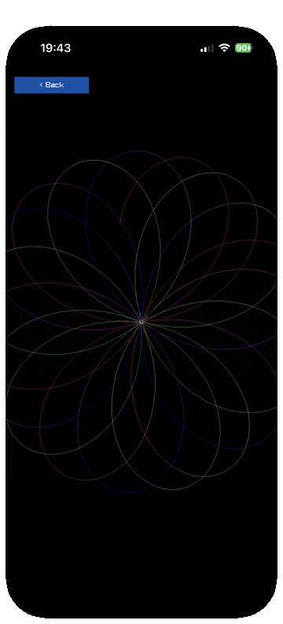

# Performance on a phone

What actually costs time when Clojure draws through raylib on an iPhone, in the
order the measurements arrived rather than the order that makes us look clever.
Every number here was read off a device, an iPhone 17 Pro on iOS 26.6.1, over
the app's own nREPL while it was running.

The headline, because it inverts the obvious guess: **the FFI is not the
bottleneck, and the sequence machinery is.**

## The obvious guess, and why it was wrong

Every draw call crosses libffi. On portable bytecode there is no JIT, and the
notebooks this project grew from clocked the interpreter at roughly 45x native
on arithmetic. So the natural model is "count your draw calls, that is your
budget", and the natural fix is to draw less.

Five scenes were ported in an afternoon and measured. Two were slow:

| scene | per frame | fps |
| --- | --- | --- |
| fireworks | ~120 circles | 58 |
| hilbert | 1023 lines, colours precomputed | 60 |
| tree | 511 branches, rebuilt each frame for the sway | 59 |
| stars | 220 circles | 58 |
| l-system | 1488 static segments, one colour | 59 |
| flow-field | 90 particles, ~630 segments | 54 |

The last two rows together make the point better than the prose does. The
L-system draws 1488 segments at 59 fps; the flow field draws roughly 630 and
managed 32. Segment count is not the variable. What separates them is that the
L-system's geometry is a vector computed once and its colour is a constant,
while the flow field steps 130 particles through trigonometry and rebuilds a
trail vector for each, every frame.

Tuning it took two rounds of the same lesson. The draw loop recomputed each
particle's field angle for its colour when the step had just computed it;
carrying the angle on the particle took it from 32 fps to 39. The rest was the
stepping itself, so the count came down: measured by re-entering the scene at
each setting, 130 gives 39, 90 gives 54 and 60 gives 59.

Hilbert is the one worth staring at. It draws MORE lines than spirograph and
runs faster, 1023 at 60 against roughly 1000 at 55, because its curve and its
per-segment colours are computed once at init and the draw loop does nothing
but read two vectors. The original recomputes each segment's colour inline from
three sin calls, which is 3069 transcendentals a frame for a picture that never
changes.
| penrose | ~2400 FFI calls: 1360 rlgl, 1020 lines | 59 |
| spirograph | ~1800 lines | 18 |
| kaleidoscope | ~1788 lines | 15 |

Penrose makes **more** FFI calls than spirograph and runs three times faster.
That kills the model outright. Whatever is costing time, it is not the calls.

## What it actually was

The difference is what the drawing loop does *around* each call.

Penrose iterates a plain vector and computes its edge colour once, outside the
loop. Spirograph did this:

```clojure
(doseq [[i [[x1 y1] [x2 y2]]] (map-indexed vector (partition 2 1 points))]
  (rl/draw-line (int x1) (int y1) (int x2) (int y2) (color (spiro/rainbow i))))
```

which per frame builds a lazy sequence of 1800 pairs, wraps each in an
index tuple, destructures four levels deep, and allocates a colour vector.
Rewritten as an indexed loop over the same vector, drawing exactly the same
lines through exactly the same FFI:

```clojure
(let [n (count points)]
  (loop [i 1]
    (when (< i n)
      (let [a (nth points (dec i)) b (nth points i)
            [r g b' a'] (spiro/rainbow i)]
        (rl/draw-line (int (nth a 0)) (int (nth a 1)) (int (nth b 0)) (int (nth b 1))
                      (rl/rgba r g b' a')))
      (recur (inc i)))))
```



*Spirograph after the loop was rewritten: the curve draws itself at 55 fps
where the lazy-sequence version managed 14 at the same point count.*

| spirograph, points | 1008 | 1288 | 1552 | 1768 |
| --- | --- | --- | --- | --- |
| lazy sequence | 14 | - | - | - |
| indexed loop | 52 | 40 | 37 | 32 |

**3.5x, with the same number of draw calls.**

Kaleidoscope had the same disease one layer down. Its pure namespace returned a
lazy sequence of ready-made segment tuples, 1788 of them, and its helper
returned `[x y]`, so two vectors were allocated per line. Handing the host a
dozen rotation triples and letting it loop by index, with the arithmetic
inlined and nothing allocated per line:

| kaleidoscope, 1068 lines | fps |
| --- | --- |
| tuples from a `for` comprehension | 22 |
| indexed loop, `place` returning `[x y]` | 22 |
| indexed loop, arithmetic inlined | 47 |

Note the middle row. Removing the lazy sequence alone changed nothing, because
the per-line allocation was still there. Both had to go.

## The rule this leaves

On this runtime, in a loop that runs hundreds of times per frame:

- **An indexed `loop`/`recur` over a vector beats any sequence function.**
  `partition`, `map-indexed`, `for` and friends are fine once per frame and
  ruinous per element.
- **Allocation is the cost, not the call.** A helper returning `[x y]` is a
  vector per invocation. Inline the arithmetic on the hot path and leave the
  readable version beside it for the tests, which is what
  `kaleidoscope/place` is for.
- **Hoist anything constant out.** Penrose was fast partly because its edge
  colour is computed once, not per line.
- **The FFI is cheap.** 2400 calls a frame held 59 fps. Do not contort a design
  to avoid draw calls until you have measured that they are the problem.

None of this is exotic Clojure advice. What is different is the magnitude: on a
JIT these habits cost a few percent, and here they cost three to four times.

<a href="../images/penrose.png"></a>
<a href="../images/kaleidoscope.png"></a>

*Left: penrose, 340 triangles and about 2400 FFI calls a frame, at 57 fps. It
is the scene that disproved the draw-call theory. Right: kaleidoscope, 708
lines a frame at 58, after the allocation came out of its draw loop.*

## Where the budget lands

With the loops fixed, the remaining limit really is line count. Numbers to
plan against, all at 59 fps unless stated:

| scene | per frame | fps |
| --- | --- | --- |
| kaleidoscope, 60-point trail | 708 lines | 58 |
| spirograph, 1000 points | ~1000 lines | 55 |
| penrose, 4 deflations | 340 triangles, ~2400 calls | 57 |
| boids, 45 | 2025 distance tests, 90 draws | 52 |
| fireworks | ~120 circles | 58 |
| lorenz, 450-point trail | 450 lines, each re-projected | 58 |
| tesseract | 32 lines | 59 |

So roughly a thousand primitives a frame is comfortable, and the scenes that
push past it carry a knob: `trail-length`, `max-points`, `default-deflations`,
`default-count`. Each is a plain `def`, which matters for the next section.

**A filled rectangle is cheaper than a line.** That thousand came from scenes
drawing lines and circles, and it turns out to understate what `DrawRectangle`
will take. The cellular automaton draws 2551 of them a frame and holds 58 fps,
which is two and a half times the figure above.

| scene | per frame | fps |
| --- | --- | --- |
| life, 48x93 grid | 1470 rectangles | 59 |
| automata, rule 30 | 2551 rectangles | 58 |

Worth knowing before sizing a grid down to fit a budget it is not actually in.
Both of those were tuned twice on the assumption that a thousand was the
ceiling, and both had room.

## When a thousand primitives is the wrong budget

Lorenz broke the rule above and it took a sweep to see why. It draws 450 lines,
well inside the comfortable range, and it will not go much past that. The
L-system draws 1488 and holds 59.

The difference is not how many lines get drawn, it is what happens per line
before the draw. The L-system's segments are computed once at init and then
handed to `DrawLine` unchanged every frame. Lorenz orbits its camera, so every
point is rotated and perspective-divided on every frame, and the cost is that
arithmetic rather than the drawing.

The first version made it worse by allocating: `project` returned a fresh
`[x y]` vector per point and `trail-colour` a fresh `[r g b]` per segment, so a
frame allocated about 2400 short-lived vectors. That ran at **18 fps**.
Rewriting the loop to carry the previous screen point in primitive `loop`
bindings and inline both computations took it to **31**, which is the same 1.7x
the draw-loop rewrite bought earlier in this guide, for the same reason.

Then the sweep, at 450 through 1200 points, reading `last-fps` after letting
raylib's 30-frame ring refill at each step:

| trail | 1200 | 1000 | 800 | 600 | 500 | 480 | 460 | 440 | 420 | 400 | 300 |
| --- | --- | --- | --- | --- | --- | --- | --- | --- | --- | --- | --- |
| fps | 25 | 23 | 29 | 32 | 56 | 59 | 59 | 58 | 58 | 59 | 59 |

Flat at vsync to 480, slipping at 500, and falling away steeply past 600. The
default is 450, which sits inside the flat region with room for a phone that
has warmed up.

**Read the steep end with suspicion.** The same 1200-point trail measured 31,
then 20, then 24 to 28 across one session, a spread of about 30% on identical
code. Once a scene is over budget the readings stop being repeatable, most
likely thermal. The flat end is solid and the cliff edge is real, but treat any
single number past the knee as indicative.

The rule the earlier sections give still holds, it just needs its terms stated
properly. The budget is per-frame *work*, and primitive count is only a good
proxy for it while the work per primitive is roughly constant. A scene that
computes geometry once and redraws it gets the thousand. A scene that recomputes
every vertex every frame gets a few hundred.

## rlgl is the wrong tool when raylib already has the call

The clock of clocks draws 144 small bezels and 288 hands. Three drafts, and the
numbers are worth keeping because two of them are counter-intuitive.

| draft | fps |
| --- | ---: |
| bezels as `draw-ring`, 20 segments each | 6 |
| bezels as `draw-circle-lines` | 50 |
| plus the hands collected into a vector for one batched call | 47 |
| plus the vector removed, vertices emitted straight from the loop | 59 |

`draw-ring` is an rlgl helper this project added because raylib's own `DrawRing`
takes its centre as a by-value Vector2. It emits 120 vertices for a 20-segment
ring, so 144 bezels is about 17,000 FFI calls a frame. `DrawCircleLines` has no
by-value argument, needs no helper, and draws the same circle in one call. rlgl
earns its place where raylib has no call for the shape. Where raylib does, it is
strictly worse.

The middle row is the one that surprised me. Drawing 288 hands through
`draw-line-ex` opens and closes an rlgl batch per line, which is three extra
calls each and 864 a frame. Collecting the segments into a vector and drawing
them in one batch removes all 864, and it measured **slower**: 47 against 50.
The batch had traded 864 FFI calls for 288 vector allocations, and on this
runtime the allocation is dearer. That is the same lesson the flow field and the
Lorenz attractor both taught earlier on this page, arriving from a direction
that looked like an optimisation.

Keeping the batch and dropping the vector gets both: one `rlBegin`, one colour,
one `rlEnd`, and every vertex computed and emitted inside the loop with nothing
allocated between them. 59 fps.

Two more scenes hit the same wall the same night, which is what makes it a rule
rather than an anecdote. The ring scene built two 97-point vectors per frame and
partitioned them into pairs to stroke its outline: 40 fps, and 59 once the
points were computed straight into the vertex stream. The spline scene was worse,
because it did that three times over, once per basis: about a thousand
allocations a frame and **20 fps**, against 59 for the same picture with the
previous point carried in a loop binding.

The shape of the fix is always the same. Keep the collection-returning function,
because tests want something to inspect, and do not call it from the draw path.
`ring/arc-points` and `splines/curve` both still exist and are both still tested.
Neither runs sixty times a second.

## How these were measured

All of it live, over the nREPL, without a rebuild between readings. That is
worth its own note because it changed how the work went.

`raylib.probe/fps-every-frame?` turns on a per-frame `GetFPS` call and parks the
answer in `last-fps`, so frame rate becomes a value to read rather than a
console line to scrape. `raylib.gallery/tap!` opens a scene without a finger.
Together they let a single session open each scene in turn and read its cost.

Two traps, both of which produced wrong numbers before they were noticed.

**Sample against the thing that varies.** Spirograph's point count cycles from
zero to its cap and resets, so a single fps reading catches an arbitrary phase.
The first four readings were 18, 17, 27 and 15, all of the same code. Reading
the point count *alongside* fps is what turned noise into a curve.

**Build `--dev` or redefinition does not reach the loop.** A release build
inlines across call sites, so `alter-var-root` updates what the REPL sees while
the running loop keeps calling the original. Every tuning number above came
from a `DEV_BUILD=1` build, where a redefined `trail-length` takes effect on
the next frame. The cost is negligible: `--dev` held mean 17.05 ms against
release's 17.02.
