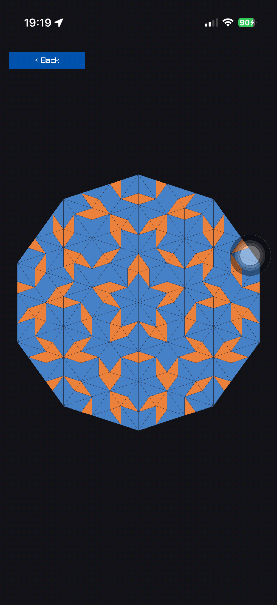

# Performance on a phone

What actually costs time when Clojure draws through raylib on an iPhone, in the
order the measurements arrived rather than the order that makes us look clever.
Every number here was read off a device, an iPhone 17 Pro on iOS 26.6.1, over
the app's own nREPL while it was running.

The headline, because it inverts the obvious guess: **the FFI is not the
bottleneck, and the sequence machinery is.**

## The obvious guess, and why it was wrong

Every draw call crosses libffi. On portable bytecode there is no JIT, and the
notebooks this project grew from clocked the interpreter at roughly 45x native
on arithmetic. So the natural model is "count your draw calls, that is your
budget", and the natural fix is to draw less.

Five scenes were ported in an afternoon and measured. Two were slow:

| scene | per frame | fps |
| --- | --- | --- |
| fireworks | ~120 circles | 58 |
| penrose | ~2400 FFI calls: 1360 rlgl, 1020 lines | 59 |
| spirograph | ~1800 lines | 18 |
| kaleidoscope | ~1788 lines | 15 |

Penrose makes **more** FFI calls than spirograph and runs three times faster.
That kills the model outright. Whatever is costing time, it is not the calls.

## What it actually was

The difference is what the drawing loop does *around* each call.

Penrose iterates a plain vector and computes its edge colour once, outside the
loop. Spirograph did this:

```clojure
(doseq [[i [[x1 y1] [x2 y2]]] (map-indexed vector (partition 2 1 points))]
  (rl/draw-line (int x1) (int y1) (int x2) (int y2) (color (spiro/rainbow i))))
```

which per frame builds a lazy sequence of 1800 pairs, wraps each in an
index tuple, destructures four levels deep, and allocates a colour vector.
Rewritten as an indexed loop over the same vector, drawing exactly the same
lines through exactly the same FFI:

```clojure
(let [n (count points)]
  (loop [i 1]
    (when (< i n)
      (let [a (nth points (dec i)) b (nth points i)
            [r g b' a'] (spiro/rainbow i)]
        (rl/draw-line (int (nth a 0)) (int (nth a 1)) (int (nth b 0)) (int (nth b 1))
                      (rl/rgba r g b' a')))
      (recur (inc i)))))
```

| spirograph, points | 1008 | 1288 | 1552 | 1768 |
| --- | --- | --- | --- | --- |
| lazy sequence | 14 | - | - | - |
| indexed loop | 52 | 40 | 37 | 32 |

**3.5x, with the same number of draw calls.**

Kaleidoscope had the same disease one layer down. Its pure namespace returned a
lazy sequence of ready-made segment tuples, 1788 of them, and its helper
returned `[x y]`, so two vectors were allocated per line. Handing the host a
dozen rotation triples and letting it loop by index, with the arithmetic
inlined and nothing allocated per line:

| kaleidoscope, 1068 lines | fps |
| --- | --- |
| tuples from a `for` comprehension | 22 |
| indexed loop, `place` returning `[x y]` | 22 |
| indexed loop, arithmetic inlined | 47 |

Note the middle row. Removing the lazy sequence alone changed nothing, because
the per-line allocation was still there. Both had to go.

## The rule this leaves

On this runtime, in a loop that runs hundreds of times per frame:

- **An indexed `loop`/`recur` over a vector beats any sequence function.**
  `partition`, `map-indexed`, `for` and friends are fine once per frame and
  ruinous per element.
- **Allocation is the cost, not the call.** A helper returning `[x y]` is a
  vector per invocation. Inline the arithmetic on the hot path and leave the
  readable version beside it for the tests, which is what
  `kaleidoscope/place` is for.
- **Hoist anything constant out.** Penrose was fast partly because its edge
  colour is computed once, not per line.
- **The FFI is cheap.** 2400 calls a frame held 59 fps. Do not contort a design
  to avoid draw calls until you have measured that they are the problem.

None of this is exotic Clojure advice. What is different is the magnitude: on a
JIT these habits cost a few percent, and here they cost three to four times.



*Penrose, 340 triangles and about 2400 FFI calls a frame, at 57 fps. This is
the scene that disproved the draw-call theory.*

## Where the budget lands

With the loops fixed, the remaining limit really is line count. Numbers to
plan against, all at 59 fps unless stated:

| scene | per frame | fps |
| --- | --- | --- |
| kaleidoscope, 60-point trail | 708 lines | 58 |
| spirograph, 1000 points | ~1000 lines | 55 |
| penrose, 4 deflations | 340 triangles, ~2400 calls | 57 |
| boids, 45 | 2025 distance tests, 90 draws | 52 |
| fireworks | ~120 circles | 58 |

So roughly a thousand primitives a frame is comfortable, and the scenes that
push past it carry a knob: `trail-length`, `max-points`, `default-deflations`,
`default-count`. Each is a plain `def`, which matters for the next section.

## How these were measured

All of it live, over the nREPL, without a rebuild between readings. That is
worth its own note because it changed how the work went.

`raylib.probe/fps-every-frame?` turns on a per-frame `GetFPS` call and parks the
answer in `last-fps`, so frame rate becomes a value to read rather than a
console line to scrape. `raylib.gallery/tap!` opens a scene without a finger.
Together they let a single session open each scene in turn and read its cost.

Two traps, both of which produced wrong numbers before they were noticed.

**Sample against the thing that varies.** Spirograph's point count cycles from
zero to its cap and resets, so a single fps reading catches an arbitrary phase.
The first four readings were 18, 17, 27 and 15, all of the same code. Reading
the point count *alongside* fps is what turned noise into a curve.

**Build `--dev` or redefinition does not reach the loop.** A release build
inlines across call sites, so `alter-var-root` updates what the REPL sees while
the running loop keeps calling the original. Every tuning number above came
from a `DEV_BUILD=1` build, where a redefined `trail-length` takes effect on
the next frame. The cost is negligible: `--dev` held mean 17.05 ms against
release's 17.02.
