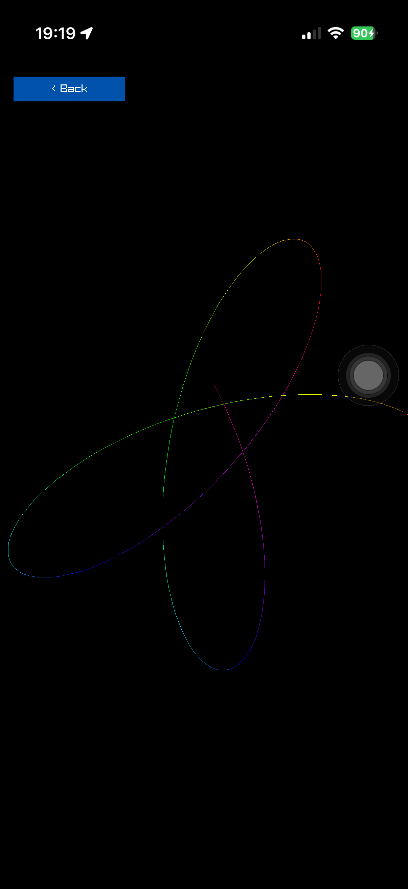

# Porting an example from raylib-jlt

[jlt-commons/raylib-jlt](https://github.com/jlt-commons/raylib-jlt) has 125
examples. 48 of them need no input at all, and those port almost mechanically.
This is what "almost" means, worked through with the five that are done.



*spirograph, the first port. Same maths as the original, a screen 1206x2622
instead of 800x450, and a loop it no longer owns.*

## They are desktop-shaped in two ways

A raylib-jlt example owns its loop:

```clojure
(defn -main [& _]
  (rl/window! :width 800 :height 450 :title "spirograph")
  (rl/set-target-fps 60)
  (loop [frame 0 st (new-params)]
    (when (rl/keep-running? deadline)
      ...
      (rl/begin-drawing) ... (rl/end-drawing)
      (recur (inc frame) st))))
  (rl/close-window))
```

and, in the ones that take input, reads the keyboard inline from inside its
model:

```clojure
(defn- step [s]
  (let [dx (cond (rl/key-pressed? rl/KEY-LEFT) -1 ...)]
    ...))
```

Neither survives on a phone. The host owns the loop here, and there is no
keyboard. The six namespaces this project carries from the Android experiment
came across byte-identical precisely because they were written the other way
round, pure and touch-first, with input arriving as a data snapshot.

## The four changes

**1. Become a reducer over frames.** The scene contract in
`poc.raylib.gallery` is `{:id :title :init :update :draw :dispose}`, where
`update` takes state and an input snapshot and returns the next state. So the
body of the original's `loop` becomes `advance`, and `-main` disappears.

**2. Derive geometry from the live screen.** The originals draw at a fixed
800x450 with constants to match: a ring at radius 170 about (400, 225). A phone
is 1206x2622. Give the namespace a `dimensions` function taking the metrics, the
way `poc.raylib.flappy-bird` does, and scale everything off the smaller
dimension so a tall phone and a wide desktop both get something that fits.

**3. Replace `GetRandomValue` with a seeded LCG.** Not for purity as an
aesthetic, but because it makes the scene runnable and testable on a build host
with no raylib, no SDL and no device, and reproducible from a seed. The
constants are `poc.raylib.flappy-bird`'s, so a seed means the same thing
everywhere:

```clojure
(defn- next-random [seed]
  (mod (+ (* 1103515245 (long seed)) 12345) 2147483648))
```

**4. Leave drawing to the host.** The pure namespace computes; a
`draw-scene!` method in `raylib.gallery` draws. Colours come back as
`[r g b a]` and the host packs them, so no raylib type reaches the scene.

## What it costs in bindings

Almost nothing, which was the surprise. Across five ports:

| example | new bindings needed |
| --- | --- |
| spirograph | none |
| kaleidoscope | none |
| fireworks | none |
| boids | none |
| penrose | four: `rlBegin`, `rlEnd`, `rlVertex2f`, `rlColor4ub` |

`DrawLine`, `DrawCircle`, `DrawText`, `DrawRectangle` and `MeasureText` cover
most of the collection. Penrose needed rlgl immediate mode only because it fills
polygons and raylib's shapes API has no call for that.

## Then measure it, because the port is the easy half

Two of the five did not hold 60 fps on first run, and neither for the reason
anyone would guess. Read
[performance-on-a-phone.md](performance-on-a-phone.md) before tuning anything:
the short version is that an indexed `loop` over a vector beats every sequence
function, allocation costs more than the FFI call it decorates, and the fix is
usually in the drawing loop rather than the model.

Give anything that scales with frame cost a plain `def` rather than a literal,
so it can be tuned live over the nREPL: `trail-length`, `max-points`,
`default-deflations`, `default-count` all exist for that reason.

## Wiring it in

Three edits, all in `raylib.gallery`:

```clojure
(:require ... [raylib.scenes.spirograph :as spiro])
(def scenes [... (spiro/scene)])
{:id :generative :title "Generative" :scenes [:spirograph ...]}
```

plus a `draw-scene!` method. Then a test namespace beside the others, since the
scene is pure and there is no excuse not to.
